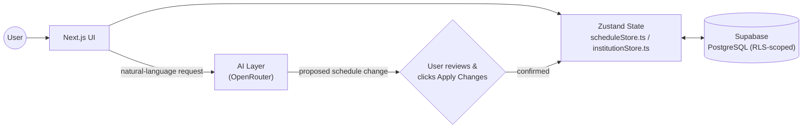
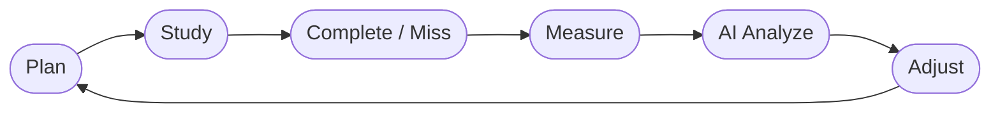

# Chronova AI

**An AI-powered academic scheduling and productivity platform — one product, two portals: a personal AI study coach for students, and a full timetable/teacher management system for institutions.**

[](https://nextjs.org/)
[](https://react.dev/)
[](https://www.typescriptlang.org/)
[](https://supabase.com/)
[](https://github.com/pmndrs/zustand)
[](#)

---

## Overview

Chronova AI turns "I have too much to do and no plan" into an actual, working weekly schedule — and then keeps it honest as real life happens to it.

A student describes what's going on in plain language ("I'm exhausted, lighten today" / "add DSA on Wednesday 10–11pm" / "I have an exam in 3 days") and the AI coach proposes a concrete change to the calendar, which the student reviews and applies with one click — nothing is written to the schedule without explicit confirmation. The same engine that manages a single student's week also powers the institution side: an admin describes their teachers, batches, and classrooms, and Chronova generates a conflict-free timetable across an entire school in minutes instead of days.

**Core value proposition:** most planning tools are either a static calendar (you do all the work) or a dumb reminder app (it doesn't understand your life). Chronova sits in between — it holds real context (your subjects, your sleep window, your exams, your teachers' availability) and uses that context to actually reason about tradeoffs, not just store events.

**Who it's for:**
- **Students** — school, college, and competitive-exam aspirants who want an adaptive study schedule instead of a spreadsheet they abandon after week one.
- **Institutions** — schools, colleges, and coaching centers that need to turn teacher/room/subject constraints into a real timetable without days of manual spreadsheet juggling, plus day-to-day teacher and class management.

---

## Features

### Student Portal

- **AI Academic Coach** — a conversational assistant (`/chat`) that understands natural-language schedule requests, explains its reasoning, and proposes changes that the student explicitly applies via an **Apply Changes** button — the calendar is never silently rewritten out from under the user.
- **Smart Calendar** — a weekly/day grid (`/calendar`) for viewing, adding, and editing study sessions, with drag-friendly session cards, color-coded subjects, and a live "AI Optimize Week" re-planning action.
- **Exam & Milestone Tracker** — chapter-by-chapter readiness tracking, AI-generated revision plans that get synced onto the calendar, risk-level forecasting per exam, and an **Upload Exam Schedule** flow that reads a photo or pasted text of an exam timetable and stages the parsed exams for one-click confirmation.
- **Progress & Analytics** — study-hour heatmaps, weekly consistency tracking, subject-level breakdowns, and unlockable achievement badges to reinforce momentum.
- **Focus Timer** — a Pomodoro-style timer that links directly to a real scheduled session (pulled live from the student's own calendar, not a generic "General Study" placeholder), auto-marks that session complete when the focus block ends, and expands to a fullscreen view for deep-focus sessions.
- **Burnout Protection** — sleep-window and workload constraints are respected by every AI-generated or AI-modified schedule; the coach proactively recommends lighter days and recovery time based on mood and workload signals.

### Institution Portal

- **Admin Dashboard** (`/admin`) — a single home for institution-wide state: teacher count, batch count, classroom count, subject count, and the timetable generator, all scoped to the admin's own institution via Row Level Security.
- **AI Timetable Generator** — turns teacher availability, subject load, and classroom capacity into a conflict-free weekly timetable per batch, with pedagogical rules baked in (harder subjects earlier, labs given longer blocks, breaks between sessions).
- **Teacher Portal** (`/teacher`) — a separate, scoped view for teaching staff: their own personal weekly schedule and a request flow (reschedule / swap / leave / substitution) that routes to the admin for approval.
- **Role-based Access** — a strict Admin → Teacher hierarchy enforced both in the UI (separate nav/sidebar per role) and at the database layer (RLS policies keyed off `institution_members`), so a teacher account can never reach admin-only data even by direct navigation.
- **Cross-role Notification System** — admin and teacher notifications are fully separated from student notifications (different tables, different UI), so an institution broadcast can never leak into — or get lost inside — a student's personal notification feed.

---

## Tech Stack

| Layer | Choice |
|---|---|
| **Framework** | [Next.js 16](https://nextjs.org/) (App Router, Turbopack) + React 19 + TypeScript |
| **State Management** | [Zustand](https://github.com/pmndrs/zustand) — `scheduleStore.ts` (student data) and `institutionStore.ts` (institution data) as the two top-level stores |
| **Database** | [Supabase](https://supabase.com/) (PostgreSQL) with Row Level Security on every table |
| **Auth** | Supabase Auth (email/password), with a single `resolveUserRole()` helper as the one source of truth for student/admin/teacher role resolution |
| **AI** | [OpenRouter](https://openrouter.ai/) chat completions API, streamed to the client, with a multi-model fallback chain for resilience against any single free-tier model being unavailable or degraded |
| **Styling** | A custom CSS design-token system (`globals.css`) — light mode only, no CSS framework dependency for layout |
| **Charts** | [Recharts](https://recharts.org/) for progress/analytics visualizations |
| **Deployment** | [Vercel](https://vercel.com/) |

---

## Architecture

### Database Schema

All tables live in Postgres via Supabase, defined across `supabase/schema.sql` (core + student tables) and `supabase/institution_portal_schema.sql` (institution-portal tables added in a later phase). Every table has Row Level Security enabled.

**Core / student tables** (`schema.sql`):
| Table | Purpose |
|---|---|
| `profiles` | One row per authenticated user — extends `auth.users` with name, education level, goals, sleep window, onboarding status. |
| `subjects` | A student's subjects, with difficulty level and priority, used by the scheduling engine. |
| `schedules` | The actual calendar events — study sessions, classes, exams, revision blocks — keyed by `user_id`. |
| `sessions` | Focus/Pomodoro session logs, optionally linked to a `schedules` row. |
| `chat_messages` | Full AI chat history per user, persisted per conversation. |
| `notifications` | Student-facing notifications (missed sessions, AI suggestions, achievements). |
| `institutions` | One row per institution — name, type, and the admin who owns it. |
| `teachers` | Institution teacher roster: subjects taught, availability window, max weekly hours. |
| `classrooms` | Institution rooms: name, capacity, type (classroom / lab / auditorium). |
| `batches` | Institution classes/sections: name, student count, age group. |
| `institution_timetables` | The generated institution timetable — one row per scheduled class slot, linking a batch, teacher, classroom, and subject. |

**Institution portal tables** (`institution_portal_schema.sql`):
| Table | Purpose |
|---|---|
| `institution_members` | The real source of truth for "who is an admin/teacher of which institution" — links a user to an institution with a role. |
| `teacher_profiles` | Per-teacher account metadata created when an admin invites a teacher. |
| `teacher_requests` | Teacher-submitted reschedule / swap / leave / substitution requests, with admin approve/reject state. |
| `institution_notifications` | Admin/teacher-facing notifications — deliberately separate from the student `notifications` table so the two feeds never mix. |

`supabase/phase2_rls_fixes.sql` contains a corrected, idempotent set of RLS policies for the institution tables (safe to re-run) and should be applied after `institution_portal_schema.sql`.

### Key Design Decisions

- **No mock data.** Every screen either reads real data from Supabase or shows an honest, explicit empty state ("No upcoming exams", "No batches yet") — nothing is faked to look populated.
- **Light mode only.** There is a single, deliberately chosen light design system — no dark-mode toggle or dark-mode tokens to maintain.
- **AI actions are always user-confirmed.** The AI coach can *propose* a schedule change, but nothing is written to `schedules` until the student clicks **Apply Changes**. The same "propose → confirm" pattern is used for the exam-timetable upload feature.
- **Role-based routing.** A single `resolveUserRole()` helper (`lib/auth/resolveRole.ts`) is the one source of truth used by `/login`, the authenticated route-group layout, and the sidebar — so a user is never shown navigation for a role they don't have, and can't get stuck in a redirect loop between portals.
- **One email, one portal.** Signup refuses to create a student account for an email that already has an institution account (and vice versa), so there's never ambiguity about which portal an email belongs to.
- **Chat history is persisted.** Every AI conversation is written to `chat_messages` per user, so context survives a page reload or a new device.

### Data Flow



The UI reads and writes through the Zustand stores, which sit as the single client-side cache in front of Supabase. The AI layer never writes directly to the database — it only ever *proposes* a diff back into that same flow, gated by an explicit user confirmation before anything reaches Postgres.

---

## Project Structure

```
chronova-ai/
├── app/
│   ├── (auth)/               # Public auth pages — no sidebar layout
│   │   ├── login/            # Single login form; role resolved after sign-in
│   │   ├── signup/           # Student signup
│   │   ├── institution/
│   │   │   └── signup/       # Dedicated institution signup (separate portal)
│   │   └── onboarding/       # Post-signup profile/subjects/schedule/goals wizard
│   ├── (app)/                 # Authenticated app — shared sidebar/nav layout
│   │   ├── dashboard/         # Student home
│   │   ├── calendar/          # Weekly/day schedule view
│   │   ├── chat/              # AI coach
│   │   ├── exams/             # Exam tracker + AI timetable upload
│   │   ├── progress/          # Analytics & achievements
│   │   ├── settings/          # Profile, sleep window, preferences
│   │   ├── admin/              # Institution admin portal
│   │   │   ├── teachers/       # Teacher roster + invite flow
│   │   │   ├── classes/        # Batches & classrooms (add/edit/delete)
│   │   │   ├── timetable/      # Institution timetable generator & grid
│   │   │   ├── requests/       # Teacher request approvals
│   │   │   └── notifications/  # Admin notification feed
│   │   └── teacher/            # Teacher portal
│   │       ├── schedule/       # Personal timetable
│   │       ├── requests/       # Submit reschedule/swap/leave requests
│   │       └── notifications/  # Teacher notification feed
│   ├── api/
│   │   ├── auth/signup/        # Account creation (student or institution)
│   │   ├── chat/                # AI coach streaming endpoint
│   │   ├── exams/parse/         # AI exam-timetable image/text parser
│   │   ├── institution/         # Timetable generation, teacher invites
│   │   └── schedule/            # Rules-based schedule generation/reschedule
│   ├── page.tsx                # Public landing page
│   └── privacy/ , terms/       # Static legal pages
├── components/                 # Shared UI (Logo, TimeInput, landing sections)
├── lib/
│   ├── store/
│   │   ├── scheduleStore.ts     # Student-side Zustand store
│   │   ├── institutionStore.ts  # Institution-side Zustand store
│   │   └── uiStore.ts           # Cross-cutting UI state
│   ├── auth/resolveRole.ts     # Single source of truth for role resolution
│   ├── scheduling/
│   │   ├── engine.ts            # Rules-based schedule generation
│   │   └── prompts.ts           # All AI system prompts, in one place
│   └── supabase/                # Browser / server / admin Supabase clients
├── supabase/
│   ├── schema.sql                    # Core schema (run first)
│   ├── institution_portal_schema.sql # Institution tables (run second)
│   └── phase2_rls_fixes.sql          # Corrected institution RLS policies (run third)
├── globals.css                 # The entire design system: tokens, components, utilities
└── .env.example                # Template for required environment variables
```

---

## Getting Started

### Prerequisites

- **Node.js 18+**
- A **Supabase** project (free tier is sufficient)
- An **OpenRouter** API key ([openrouter.ai](https://openrouter.ai/)) — free-tier models work out of the box

### Installation

```bash
# 1. Clone the repository
git clone <repository-url>
cd chronova-ai

# 2. Install dependencies
npm install

# 3. Copy the environment template and fill in your credentials
cp .env.example .env.local

# 4. Run the database setup (see "Database Setup" below) before starting the app

# 5. Start the dev server
npm run dev
```

The app will be running at **http://localhost:3000**.

### Environment Variables

All variables are documented in `.env.example`. Copy it to `.env.local` and fill in real values — **never commit `.env.local`**.

| Variable | Required | Description |
|---|---|---|
| `OPENROUTER_API_KEY` | Yes | API key for [OpenRouter](https://openrouter.ai/), powers the AI Coach and exam-timetable parsing. |
| `OPENROUTER_MODEL` | No | Preferred model slug (defaults to `openrouter/free`); the app falls back through several other free models automatically if the preferred one is unavailable or returns an unusable response. |
| `NEXT_PUBLIC_SUPABASE_URL` | Yes | Your Supabase project URL. |
| `NEXT_PUBLIC_SUPABASE_ANON_KEY` | Yes | Supabase anon/public key — safe to expose client-side, scoped by RLS. |
| `SUPABASE_SERVICE_ROLE_KEY` | Yes | Supabase service-role key — **server-side only**, used for account creation and institution provisioning. Never expose this to the client. |
| `NEXTAUTH_URL` | Yes | Base URL of the app (e.g. `http://localhost:3000` in development). |
| `NEXT_PUBLIC_APP_URL` | Yes | Public-facing base URL, used in a few client-side absolute links. |

### Database Setup

Run these files, in order, in your Supabase project's **SQL Editor** (Project → SQL Editor → New Query):

1. **`supabase/schema.sql`** — core schema: profiles, subjects, schedules, sessions, chat messages, notifications, and the base institution/teacher/classroom/batch tables. Also sets up the `handle_new_user` trigger that auto-creates a `profiles` row on signup.
2. **`supabase/institution_portal_schema.sql`** — adds `institution_members`, `teacher_profiles`, `teacher_requests`, and `institution_notifications`. Depends on tables created in step 1.
3. **`supabase/phase2_rls_fixes.sql`** — replaces an earlier, buggy set of institution RLS policies with a corrected, idempotent version. Safe to run even on a fresh database.

Each file is idempotent (`create table if not exists`, `drop policy if exists` + `create policy`), so re-running them is safe if you need to reset or update your schema.

---

## User Roles

Chronova has exactly three roles, resolved by a single shared function (`resolveUserRole()`) so every part of the app agrees on who a user is:

| Role | Access | How it's assigned |
|---|---|---|
| **Student** | Full student portal — dashboard, calendar, AI chat, exams, progress, settings. | Default role for anyone who signs up at `/signup`. |
| **Institution Admin** | Full institution management — teacher roster, batches/classrooms, timetable generator, request approvals, admin notifications. | Set at signup via `/institution/signup`, which creates the `institutions` row and an `institution_members` admin row immediately. |
| **Teacher** | Scoped teacher portal — personal schedule and request submission only; no access to other teachers' data or admin controls. | Created by an institution admin from the **Teachers** page (**Add Teacher**) — teachers never self-register. |

One email can only ever belong to one portal (student *or* institution) — signup explicitly rejects a duplicate email across portals with a specific, actionable error message rather than a generic "already registered".

---

## Product Loop

Chronova is built around one repeating loop, for both a single student and an entire institution:



1. **Plan** — a schedule is built (onboarding wizard, rules-based engine, or AI timetable generator).
2. **Study** — the student works the plan, using the Focus Timer to run and track individual sessions.
3. **Complete / Miss** — each session is explicitly marked done, missed, or rescheduled — nothing silently disappears.
4. **Measure** — progress, consistency, and workload are tracked continuously (streaks, heatmaps, readiness %).
5. **AI Analyze** — the coach reads that real history (not just the plan) to spot burnout risk, falling-behind subjects, or an unrealistic load.
6. **Adjust** — the coach proposes a concrete change; the student reviews and applies it — closing the loop back into **Plan**.

---

## Deployment

Chronova is designed to deploy to **[Vercel](https://vercel.com/)** with zero extra configuration beyond environment variables.

1. Push the repository to GitHub (or your Git provider of choice).
2. In Vercel, **Import Project** and select the repository.
3. Under **Project Settings → Environment Variables**, add every variable listed above (`OPENROUTER_API_KEY`, `OPENROUTER_MODEL`, `NEXT_PUBLIC_SUPABASE_URL`, `NEXT_PUBLIC_SUPABASE_ANON_KEY`, `SUPABASE_SERVICE_ROLE_KEY`, `NEXTAUTH_URL`, `NEXT_PUBLIC_APP_URL`) — set `NEXTAUTH_URL` and `NEXT_PUBLIC_APP_URL` to your production domain (e.g. `https://your-app.vercel.app`).
4. Deploy. Vercel will run `npm run build` automatically on every push to the connected branch.
5. Make sure the Supabase database has all three schema files applied (see **Database Setup**) *before* the first production sign-up — the app has no self-healing migration step.

---

## Roadmap

- [ ] Google OAuth (sign in without a password)
- [ ] Email notifications (schedule reminders, exam countdowns, teacher request updates)
- [ ] Mobile app (native iOS/Android, or a PWA wrapper as a first step)
- [ ] Multi-language support
- [ ] Advanced analytics (predictive burnout scoring, cohort-level institution insights)
- [ ] Parent portal (read-only visibility into a student's schedule and progress)

---

<p align="center">
  Built for students and institutions who are tired of schedules that don't adapt to real life.
</p>
